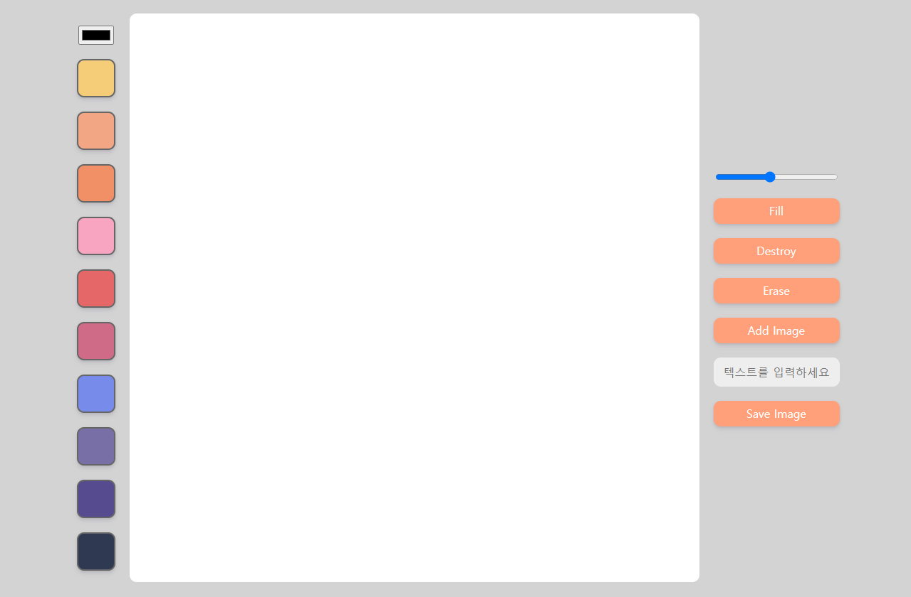

## Drawing-Board
by.노마드 코더 Meme Maker 

#### [ data- (데이터 속성) 활용 ]

- color-option에 data-color에서 사용
  * event.target의 dataset에 접근하여 color 값을 가져오는 작업
- data- 다음에 html 요소 안에 넣고 싶은 값을 자유롭게 넣을 수 있음
(임의로 만들어진 속성인 사용자 지정 데이터)
- 넣은 값을 활용하여 JavaScript, CSS에서 사용 가능

- 사용 이유 ?
   * 화면에 보이지 않게 추가 정보를 담아둘 수 있음 => 코드가 훨씬 간결해짐 (가독성 ↑)
     
 

#### [Preview]

